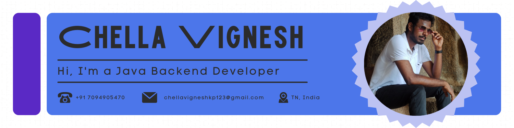

## Hi there 👋
I'm Chella Vignesh K P, a passionate software engineer with experience in Spring, Angular, Linux, PostgreSQL, and Docker. Currently, I'm exploring data science and expanding my skills in various technologies.

### 🔭 I’m currently working on
- Building microservices with Spring Boot
- Developing threat analysis model using D3FEND and ATT&CK framework
- Dockerizing applications for streamlined deployment

### 🌱 I’m currently learning
- Advanced data science techniques
- Kubernetes for container orchestration
- Machine learning with Python

### 👯 I’m looking to collaborate on
- Open source projects related to web development and data science
- Innovative projects that leverage microservices architecture

### 🤔 I’m looking for help with
- Enhancing my knowledge in DevOps practices
- Optimizing my data science workflows

### 💬 Ask me about
- Anything related to Spring Boot and microservices
- Tips for getting started with Docker and Kubernetes
- How to integrate 3D models into web applications

### 😄 Pronouns: He/Him

### ⚡ Fun fact
- I used to play the keyboard and have actively participated in NCC during my college years.

---

  
  

### Workflows:
- **Spring Boot**: Building robust and scalable microservices
- **Angular**: Crafting dynamic and responsive web applications
- **Docker**: Containerizing applications for seamless deployment
- **Kubernetes**: Managing containerized applications at scale
- **Data Science**: Analyzing data and building predictive models with Python

---

<!-- Repo Stickers -->

### Connect with me:

